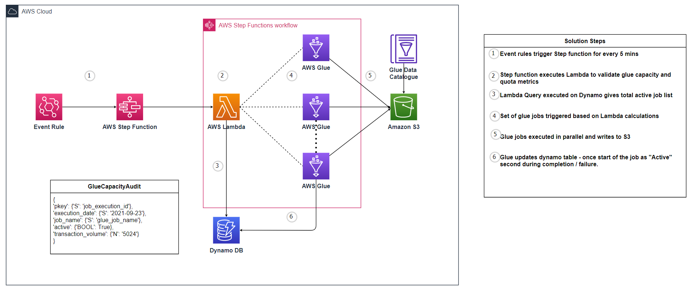

# AWS Glue audit framework to efficiently control resource quota.

# Introduction

Creating and running Glue jobs require additional auditing and logging methods for efficient tracking of job status and resource quota. Glue console dashboard is the first place to review these metrics but as the number of jobs increases along with more complex multiple instance job runs users face the challenge of hitting the maximum limits on glue quota.

There are few quota to monitor during glue concurrent run of jobs / instance of same job.

* Max concurrent job runs per account
* Max concurrent job runs per job
* Max connection per account
* Max jobs per account
* Max task dpus per account
* Number of IP address in your subnet

The first lower limit you will hit is max concurrent job runs per account this is set to 50 but this can be increased upon request using service request. 

Please refer below link to understand complete list of AWS Glue quota.
https://docs.aws.amazon.com/general/latest/gr/glue.html

As more adoption of Glue happens there is a need to dynamically monitor and schedule Glue jobs based on available IP addresses in your private subnet and max DPU setting combined with account level concurrency limits.

As part of this repository, we walk through a solution where we create Glue audit framework to efficiently manage resource quota and schedule AWS Glue jobs using step functions. This solution is useful for large enterprise running more than 100 instance of Glue jobs regularly within private subnet where availability of IP address and DPU capacity is main contraint for job scheduling.

## Glue quota auditing framework
This is an overview of the architecture described above: 

## Data
The data used in this demo solution is from public glue dataset available in below location.

Amazon S3 bucket at s3://awsglue-datasets/examples/medicare/Medicare_Hospital_Provider.csv

## Solution Steps

1. Event rules trigger Step function for every 5 mins

2. Step function executes Lambda to validate glue capacity and quota metrics

3. Lambda Query executed on Dynamo DB gives total active job list

4. Set of glue jobs triggered based on Lambda calculations

5. Glue jobs executed in parallel and writes to S3

6. Glue updates dynamo table - once start of the job as "Active" second during completion / failure.

Useful links to familiarize AWS resources used in this solution.

* [AWS Glue ](https://aws.amazon.com/glue/)
* [Amazon EventBridge Rule](https://docs.aws.amazon.com/eventbridge/latest/userguide/eb-create-rule-schedule.html)
* [AWS Step Functions](https://aws.amazon.com/step-functions/)
* [Amazon DynamoDB](https://aws.amazon.com/dynamodb/)
* [AWS Lambda](https://aws.amazon.com/lambda/)
​

 
## License Summary

This sample code is made available under the MIT-0 license. See the [LICENSE](LICENSE) file.